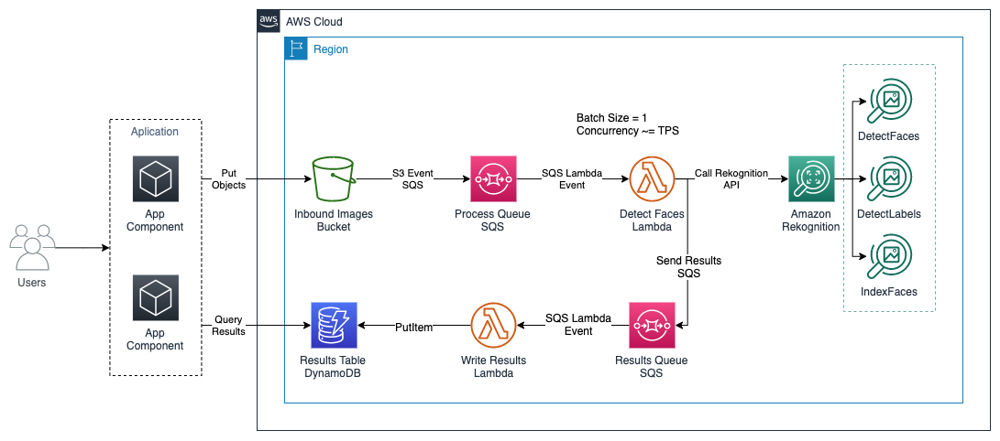

# Amazon Rekognition Large Scale Processing

The objective of this article is to carry out a detailed review of strategies and a solution that we can incorporate into high demand applications in the use of the Amazon Rekognition API (specifically DetectFaces) that require temporarily exceeding the service quota without incurring errors on the side. of the application, we will see it from the point of view of Architecture, as well as recommendations on handling errors in API calls.

This code sample is discussed in detail in this AWS [Blog Post](https://aws.amazon.com/blogs/).

### Architecture



### Usage

#### Prerequisites

- An AWS Account 
- AWS CDK for Python
- AWS CLI configured with access creadentials
- Python 3.6+
- IAM Privileges to deploy the components of the architecture

#### Deployment

1 - Clone the code in this repository. 

2 - Proceed with the following commands in the Terminal. 

```
npm install -g aws-cdk
cd amazon-rekognition-large-scale-processing
python3 -m venv .env
source .env/bin/activate
pip install -r requirements.txt
cdk deploy
```

3 - Check the correct deployment: The result from the last section is the AWS S3 bucket in wich to upload the images, the results of the image processing will be available in the AWS DynamoDB Table ```detect_faces_results```

#### Cleanup

In order to delete all the components deployed by this solution and avoid additional charges:

1 - Proceed with the following commands in the Terminal.

```
cd amazon-rekognition-large-scale-processing
cdk destroy                       		 # This comand will delete all the deployed resources
```

2 - Delete the AWS DynamoDB Table ```detect_faces_results```: Navigate to AWS DynamoDB service in the AWS Console > Look for the results table and proceed to delete the table.

3 - Delete the Amazon S3 Bucket: Navigate to the Amazon S3 service in the AWS Console > Search the bucket name from the output of the deployment process and proceed to delete the bucket.

### Making changes to the code and customization

The [contributing guidelines](CONTRIBUTING.md) contains some instructions about how to run the front-end locally and make changes to the back-end stack.

## Contributing

Contributions are more than welcome. Please read the [code of conduct](CODE_OF_CONDUCT.md) and the [contributing guidelines](CONTRIBUTING.md).

## Licensing

See the [LICENSE](LICENSE) file for our project's licensing. We will ask you to confirm the licensing of your contribution.

We may ask you to sign a [Contributor License Agreement (CLA)](http://en.wikipedia.org/wiki/Contributor_License_Agreement) for larger changes.

